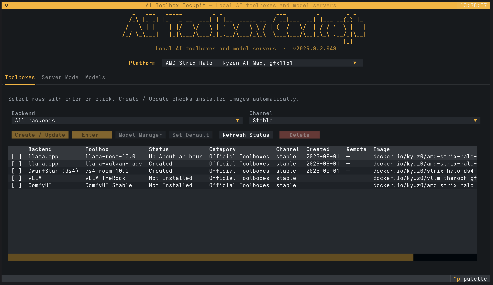

# AI Toolbox Cockpit

AI Toolbox Cockpit is a Textual terminal application for running a local AI workstation without memorising a different container workflow for every backend.

<p align="center">
  
</p>

Choose the hardware platform once, then use one cockpit to:

- install, update, enter, and delete compatible Toolbx/Distrobox containers;
- manage llama.cpp and DS4 GGUF files;
- inspect vLLM Hugging Face repositories and cache state;
- open ComfyUI's workflow-aware model manager;
- configure and launch llama.cpp, DS4, vLLM, or ComfyUI servers.

The cockpit does not pretend these backends are interchangeable. Each backend owns its model semantics, server form, validation, and command builder. Shared container behavior lives in one runtime layer.

## Install

Install the current GitHub version in an isolated environment:

```bash
# Debian/Ubuntu: sudo apt install pipx
# Fedora: sudo dnf install pipx
# Arch: sudo pacman -S python-pipx
pipx ensurepath
```

```bash
pipx install git+https://github.com/kyuz0/ai-toolbox-cockpit.git
```

Run it with:

```bash
ai-toolbox-cockpit
```

Upgrade an existing pipx installation with:

```bash
pipx upgrade ai-toolbox-cockpit
```

The cockpit checks GitHub tags in the background at startup. When a newer version is available, it shows the exact command in a persistent update strip and provides an **Upgrade now** button that runs the pipx upgrade after confirmation.

Every non-workflow push to `main` runs `.github/workflows/auto-version.yml`. It generates a UTC CalVer version (`YYYY.M.D.HHMM`), updates `pyproject.toml`, commits the bump as `github-actions[bot]`, creates the matching `v<version>` tag, and pushes the commit and tag. Those tags are what the cockpit's update check compares against the installed pipx version.

For local development:

```bash
git clone https://github.com/kyuz0/ai-toolbox-cockpit.git
cd ai-toolbox-cockpit
pipx install --editable .
```

## Runtime requirements

AI Toolbox Cockpit supports either of these interactive-container combinations:

- Podman with Toolbx;
- Podman with Distrobox;
- Docker with Distrobox.

When both engines are installed, Distrobox can be pinned explicitly:

```bash
DBX_CONTAINER_MANAGER=docker ai-toolbox-cockpit
```

The server views launch native `podman run` or `docker run` commands. They mount host model/cache directories so data survives toolbox refreshes.

## What each view does

### Toolboxes

The Toolboxes view is the shared container control plane.

- Platform selection removes incompatible images from the list.
- Backend and channel filters keep a large catalog manageable.
- Row checkboxes are real selection state; moving the cursor does not select anything.
- Refresh inspects installed containers without starting them.
- Check Updates compares the registry tag timestamp with the local container creation time.
- Create / Update pulls selected images and recreates only confirmed update targets.
- Enter suspends the TUI while an interactive Toolbx/Distrobox shell is active.
- Delete always asks for confirmation.
- Model Manager opens ComfyUI's maintained in-toolbox `model_manager`.

The catalog currently carries 25 toolbox definitions across AMD Strix Halo, Radeon AI PRO R9700, NVIDIA GB10, and Intel Arc B70.

### Server Mode

Every server endpoint has its own source file and pure command builder under `ai_toolbox_cockpit/backends/<backend>/`.

| Backend | Controls and defaults |
| --- | --- |
| llama.cpp | Local GGUF, image/engine, context, GPU layers, load mode, flash attention, KV-cache type, API key, GPU visibility, inference profiles, vision projector, MTP, and extra `llama-server` arguments |
| DS4 | Exact local GGUF, context, graph/distributed prefill, disk KV cache, SSD expert streaming, MTP path, and standalone/coordinator/worker roles |
| vLLM | Hugging Face repository, tensor parallelism, concurrency, context, GPU utilisation, dtype, eager mode, API key, attention backend, and persistent HF/vLLM/Triton/AITER caches |
| ComfyUI | Model/input/output/user paths, host/port, BF16 VAE, GPU-only mode, mmap/smart-memory behavior, and cache mode |

The vLLM catalog imports the toolbox's model launch recipe rather than replacing it with generic defaults. Model-specific environment variables, parser flags, valid tensor-parallel sizes, eager mode, context, and locked attention implementations are applied by the command builder. DeepSeek V4, for example, keeps its model-specific sparse MLA path and does not receive a generic `--attention-backend` flag.

Toolbox-specific policy overrides keep hardware families separate. The GB10 vLLM image uses one GPU, vLLM's automatic CUDA attention selection, and no ROCm-only environment variables.

Purpose-built llama.cpp forks can declare a validated `recommended_use` profile in `toolboxes.json`. The server view uses it to explain the intended platform/model pairing, show operational notes, select an installed tested quant, apply fork-specific defaults, and warn before launch when the user deviates. The EngramHalo profile uses this mechanism for its SSD-backed engram, Q8 KV, and combined MTP/ngram recipe.

Server actions are enabled. Starting a server shows its generated command, suspends the TUI, runs the named container in the foreground, and removes that container after Ctrl+C.

## Model behavior

`models.json` has four deliberately different sections:

- `llama_cpp.models`: curated GGUF repositories, inference profiles, MTP metadata, vision projector patterns, and compatibility;
- `ds4.models`: exact filenames, sizes, repositories, family metadata, and server defaults;
- `vllm.models`: Hugging Face repository IDs plus the launcher defaults imported from the vLLM toolbox;
- `comfyui.bundles`: workflow/model families, variant choices, and the toolbox downloader script used by `model_manager`.

The shipped catalog currently contains 29 llama.cpp repositories, 13 DS4 artifacts, 15 vLLM repositories, and 26 ComfyUI bundles.

llama.cpp and DS4 downloads are explicit, confirmed Hugging Face CLI operations. A llama.cpp model can also declare auxiliary downloads, such as a fork-specific MTP sidecar repository, without presenting the sidecar as a standalone main model. vLLM downloads from Hub when `vllm serve` resolves a repository. ComfyUI downloads are delegated to the image's workflow-aware manager because one workflow may require several checkpoints, encoders, VAEs, and LoRAs.

## Platforms and catalog scope

| Platform | Current catalog |
| --- | --- |
| AMD Strix Halo / gfx1151 | llama.cpp ROCm/Vulkan, vLLM TheRock, ComfyUI, and DS4 variants |
| AMD Radeon AI PRO R9700 / gfx1201 | llama.cpp ROCm/Vulkan and experimental DS4 gfx1201 |
| Intel Arc B70 | llama.cpp SYCL and Vulkan |
| NVIDIA GB10 | [GB10 Toolboxes](https://github.com/kyuz0/gb10-toolboxes): llama.cpp CUDA 13, DS4 CUDA 13, and experimental vLLM CUDA 13 nightly |

Platform state is global and saved in `~/.config/ai-toolbox-cockpit/config.json`. Backend model directories and compiler-cache paths live in the same version-independent configuration.

## Architecture

```text
ai_toolbox_cockpit/
├── app.py                     # thin app shell, theme, platform state, update notice
├── assets/
│   ├── toolboxes.json         # platforms, full OCI refs, container names, capabilities
│   └── models.json            # four backend-specific model/bundle schemas
├── catalog/                   # typed loading and cross-reference validation
├── runtime/                   # engines, Toolbx/Distrobox, registry, process lifecycle
├── views/                     # unified Toolboxes, Server Mode, and Models shells
└── backends/
    ├── llama_cpp/             # server and GGUF manager
    ├── ds4/                   # server and exact-artifact model manager
    ├── vllm/                  # server and HF defaults/cache browser
    └── comfyui/               # server and workflow-bundle/model-manager bridge
```

Important boundaries:

- JSON is data only; it cannot provide arbitrary shell templates.
- Runtime container names and display names are separate fields.
- `app.py` does not construct backend commands.
- Interactive operations suspend Textual before taking over the terminal.
- API keys are entered at launch time and are not persisted.

The complete schema rules and backend addition sequence are in [`docs/ARCHITECTURE.md`](docs/ARCHITECTURE.md). The one-backend-at-a-time hardware test procedure is in [`docs/REMOTE_VALIDATION.md`](docs/REMOTE_VALIDATION.md).

The complete schema and extension contract are in [`docs/ARCHITECTURE.md`](docs/ARCHITECTURE.md).

## Milestones

### Milestone 1 — unified foundation: implemented

- Versioned catalogs and validation
- Platform/backend/channel navigation
- Podman/Docker and Toolbx/Distrobox discovery
- Full toolbox lifecycle and Docker Hub update checks
- Persistent settings and migration reads from the old cockpit files

### Milestone 2 — existing cockpit parity: implemented

- llama.cpp GGUF manager, server mode, vision, profiles, and MTP
- DS4 exact model manager, standalone/distributed server mode, disk KV cache, SSD streaming, and model defaults

### Milestone 3 — additional backends: implemented, hardware validation ongoing

- vLLM defaults-aware HF/cache browser and direct server launcher
- ComfyUI workflow catalog, existing model-manager bridge, and direct server launcher

The code and generated commands are covered locally. The GB10 llama.cpp, DS4, and vLLM paths have been exercised with real models; additional platform/backend combinations still need one-at-a-time validation on their intended hardware. See `IMPLEMENTATION_NOTES.md`.
The executable checklist is in [`docs/REMOTE_VALIDATION.md`](docs/REMOTE_VALIDATION.md).

### Milestone 4 — platform expansion: ongoing

- Extend the GB10 catalog beyond its llama.cpp, DS4, and vLLM toolboxes
- Add future backend packages without changing the app shell

## Safe local validation

The local suite does not pull images, create containers, download models, or run a GPU workload:

```bash
python -m pytest -q
python -m compileall -q ai_toolbox_cockpit
python -m pip wheel --no-deps --no-build-isolation . --wheel-dir dist
```

Command tests cover toolbox operations and representative llama.cpp, DS4, vLLM, and ComfyUI launch construction. The Textual smoke test mocks container inspection and the update network call.
